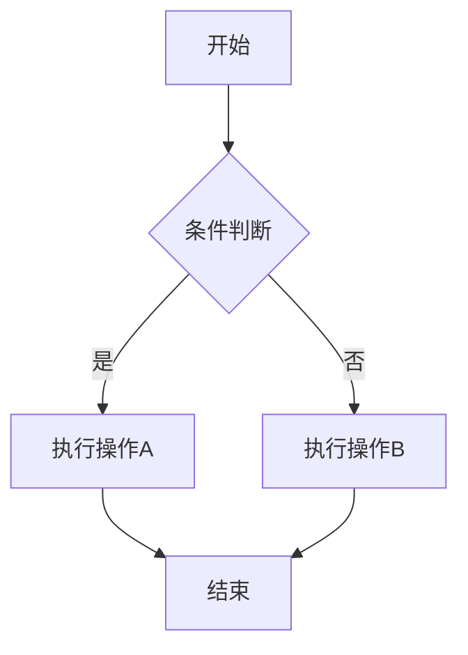
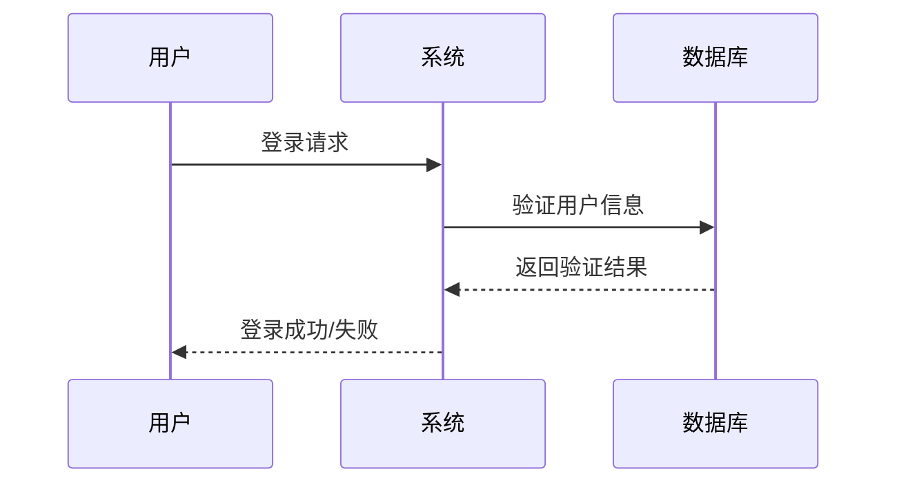

# Mermaider - 专业的在线Mermaid图表编辑器


## 🚀 项目简介

Mermaider 是一款功能强大的在线Mermaid图表编辑器，专为开发者、产品经理、系统架构师和业务分析师设计。支持多种图表类型的实时编辑和预览，让复杂的流程图、架构图制作变得简单高效。

## ✨ 核心功能

### 📊 支持的图表类型
- **流程图 (Flowchart)** - 业务流程、决策流程可视化
- **时序图 (Sequence Diagram)** - 系统交互、API调用流程
- **类图 (Class Diagram)** - 面向对象设计、数据模型
- **状态图 (State Diagram)** - 状态机、业务状态流转
- **甘特图 (Gantt Chart)** - 项目管理、时间规划
- **饼图 (Pie Chart)** - 数据分析、比例展示
- **思维导图 (Mind Map)** - 知识结构、头脑风暴

### 🛠️ 编辑器功能
- **实时预览** - 代码修改即时反映到图表
- **语法高亮** - 专业的代码编辑体验
- **行号对齐** - 精确的代码定位
- **智能提示** - 减少语法错误
- **代码折叠** - 管理复杂图表代码

### 📁 模板库
- **业务流程模板** - 常见业务场景
- **技术架构模板** - 系统设计参考
- **项目管理模板** - 敏捷开发流程
- **数据分析模板** - 可视化图表

### 💾 导出与保存
- **PNG导出** - 高质量图片输出
- **本地保存** - 图表历史管理
- **一键复制** - 快速分享代码
- **剪贴板集成** - 无缝工作流

## 🎯 适用场景

### 软件开发
- 系统架构设计
- API接口文档
- 数据库设计
- 代码流程说明

### 产品设计
- 用户流程图
- 产品功能架构
- 业务逻辑梳理
- 需求分析图

### 项目管理
- 项目时间规划
- 任务依赖关系
- 里程碑管理
- 资源分配图

### 教育培训
- 知识结构图
- 学习路径规划
- 概念关系图
- 教学流程设计

## 🚀 快速开始

### 在线使用
访问 [Mermaider在线编辑器](https://mermaider.online) 即可开始使用，无需安装任何软件。

### 本地开发

```bash
# 克隆项目
git clone https://github.com/your-username/mermaider.git

# 进入项目目录
cd mermaider

# 安装依赖
yarn install

# 启动开发服务器
yarn dev
```

访问 `http://localhost:8000` 查看应用。

## 🛠️ 技术栈

- **前端框架**: React 18 + TypeScript
- **图表引擎**: Mermaid.js
- **UI组件**: Radix UI + Tailwind CSS
- **代码编辑**: React Syntax Highlighter
- **状态管理**: Zustand
- **构建工具**: ESBuild
- **样式方案**: Tailwind CSS + CSS Modules

## 📖 使用指南

### 基础流程图示例



### 时序图示例



## 🎨 界面预览

### 主界面
- 左侧：代码编辑器，支持语法高亮和行号显示
- 右侧：实时预览区域，图表即时渲染
- 顶部：工具栏，包含保存、导出、模板等功能
- 底部：状态栏，显示当前图表信息

### 模板库
- 分类浏览：按图表类型和应用场景分类
- 快速预览：鼠标悬停即可预览模板效果
- 一键应用：点击即可将模板代码加载到编辑器

## 🔧 配置选项

### Mermaid配置
- 主题设置：支持多种内置主题
- 安全级别：可配置脚本执行权限
- 渲染选项：自定义图表样式和行为

### 编辑器配置
- 字体设置：可选择等宽字体
- 主题切换：明暗主题支持
- 快捷键：自定义编辑快捷键

## 🤝 贡献指南

我们欢迎所有形式的贡献！

### 如何贡献
1. Fork 本项目
2. 创建特性分支 (`git checkout -b feature/AmazingFeature`)
3. 提交更改 (`git commit -m 'Add some AmazingFeature'`)
4. 推送到分支 (`git push origin feature/AmazingFeature`)
5. 开启 Pull Request

### 开发规范
- 遵循 TypeScript 严格模式
- 使用 ESLint 和 Prettier 格式化代码
- 编写单元测试覆盖新功能
- 更新相关文档

## 📝 更新日志

### v1.0.0 (2024-01-XX)
- ✨ 初始版本发布
- 🎨 支持多种Mermaid图表类型
- 🛠️ 实现代码编辑器和实时预览
- 📁 内置丰富的模板库
- 💾 支持PNG导出和本地保存

## 📄 许可证

本项目采用 MIT 许可证 - 查看 [LICENSE](LICENSE) 文件了解详情。

## 🙏 致谢

- [Mermaid.js](https://mermaid-js.github.io/) - 强大的图表渲染引擎
- [React](https://reactjs.org/) - 优秀的前端框架
- [Tailwind CSS](https://tailwindcss.com/) - 实用的CSS框架
- [Radix UI](https://www.radix-ui.com/) - 无障碍UI组件库

## 📞 联系我们

- 项目主页: [https://mermaider.online](https://mermaider.online)
- 问题反馈: [GitHub Issues](https://github.com/your-username/mermaider/issues)
- 邮箱: contact@mermaider.online

---

⭐ 如果这个项目对你有帮助，请给我们一个星标！

**让图表制作更简单，让思维可视化更高效！**